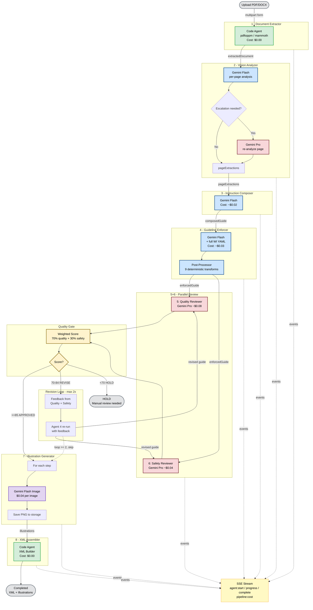
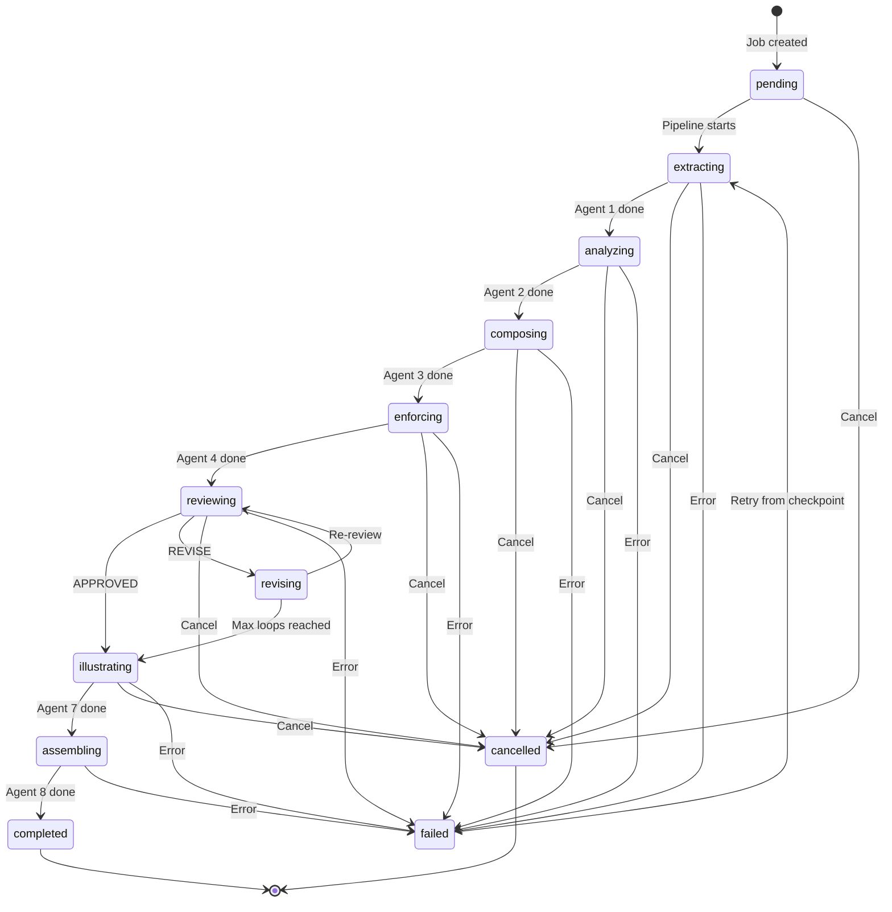

# Agent Pipeline Workflow

> **To render in VS Code:** Install the [Markdown Preview Mermaid Support](https://marketplace.visualstudio.com/items?itemName=bierner.markdown-mermaid) extension, then reopen preview (Cmd+Shift+V).

## Full Pipeline Flow



## Pipeline States



## Data Flow Between Agents

```mermaid
flowchart LR
    PDF["PDF / DOCX"] --> A1
    A1["1: Extractor\npages + text"] --> A2
    A2["2: Vision\nsteps per page"] --> A3
    A3["3: Composer\nunified guide"] --> A4
    A4["4: Enforcer\napproved verbs\nstructured parts"] --> A56
    A56["5+6: Review\nscore + issues"] --> A7
    A7["7: Illustrator\nPNG per step"] --> A8
    A8["8: Assembler\nCanonical XML"]

    classDef input fill:#e2e3e5,stroke:#6c757d,color:#000
    classDef code fill:#d4edda,stroke:#28a745,color:#000
    classDef flash fill:#cce5ff,stroke:#004085,color:#000
    classDef pro fill:#f8d7da,stroke:#721c24,color:#000
    classDef image fill:#e2d5f1,stroke:#6f42c1,color:#000

    class PDF input
    class A1,A8 code
    class A2,A3,A4 flash
    class A56 pro
    class A7 image
```



## Cost Breakdown (24-page PDF)

```
Agent 1  Document Extractor   ██                                    $0.00  (code)
Agent 2  Vision Analyzer      ██████                                $0.06  (Flash + Pro)
Agent 3  Instruction Composer ████                                  $0.02  (Flash)
Agent 4  Guideline Enforcer   █████                                 $0.03  (Flash)
Agent 5  Quality Reviewer     ████████                              $0.08  (Pro)
Agent 6  Safety Reviewer      ██████                                $0.04  (Pro)
Agent 7  Illustration Gen.    ██████████████████████████████████████ $0.70  (Flash Image)
Agent 8  XML Assembler        ██                                    $0.00  (code)
                                                                   ──────
                                                            Total  ~$0.93
```
